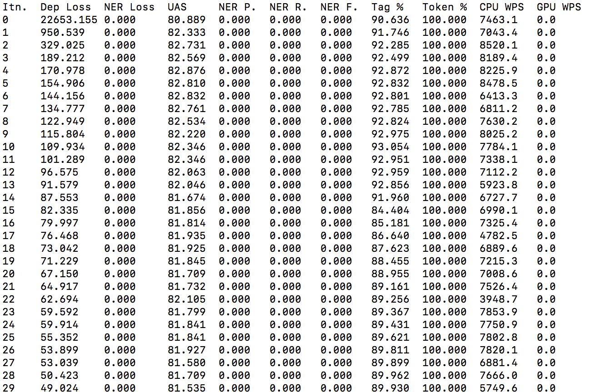
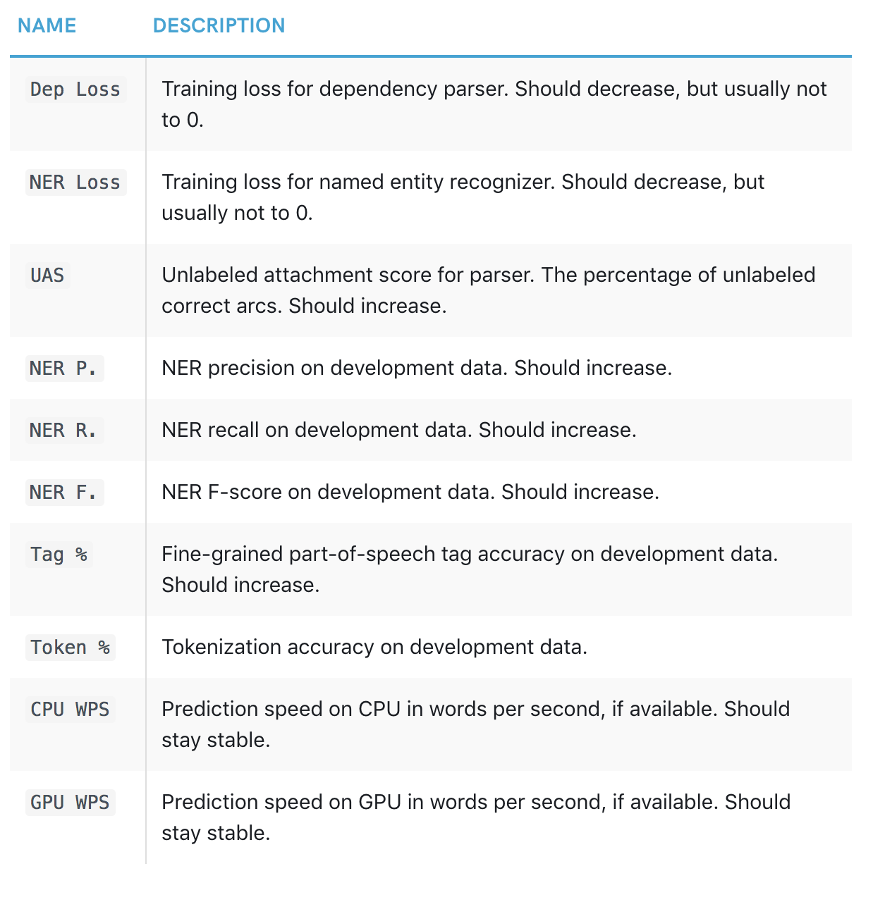

# Experimental Indonesian language model for Spacy 
Indonesian language model trained on UD_Indonesian_GSD v2.2 (2018-03-01) available here: 

https://github.com/UniversalDependencies/UD_Indonesian-GSD

Lemmas, XPOS and morphological features comes from MorphInd (created by Septina Dian Larasati, run and converted by Dan Zeman, http://septinalarasati.com/morphind/).

Command used to train the model:

`python -m spacy train id models id_gsd-ud-train.json id_gsd-ud-dev.json`

## Installation

To install the package use this command:  
`pip install https://github.com/jeannefukumaru/id_dep_ud_sm/tree/master/id_dep_ud_sm/id_dep_ud_sm-0.0.1/dist/id_dep_ud_sm-0.0.1.tar.gz`

# Usage

```python
import spacy
id = spacy.load("id_dep_ud_sm")

doc = id("Bantulah kami melengkapi berita dan informasi")

for token in doc:
    print(token.text, token.lemma_, token.pos_, token.tag_, token.dep_,
            token.shape_, token.is_alpha, token.is_stop)
```

## Training results:

- dropout_from = 0.2 by default 
- dropout_to = 0.2 by default 
- dropout_decay = 0.0 by default 
- batch_from = 1 by default 
- batch_to = 16 by default 
- batch_compound = 1.001 by default 
- max_doc_len = 5000 by default 
- beam_width = 1 by default 
- beam_density = 0.0 by default   
Warning: Unnamed vectors -- this won't allow multiple vectors models to be loaded. (Shape: (0, 0))  
- learn_rate = 0.001 by default 
- optimizer_B1 = 0.9 by default 
- optimizer_B2 = 0.999 by default
- optimizer_eps = 1e-08 by default  
- L2_penalty = 1e-06 by default 
- grad_norm_clip = 1.0 by default 
- embed_size = 7000 by default 
- token_vector_width = 128 by default 
- parser_hidden_depth = 1 by default 
- parser_maxout_pieces = 2 by default 
- token_vector_width = 128 by default 
- hidden_width = 200 by default 
- embed_size = 7000 by default 
- history_feats = 0 by default 
- history_width = 0 by default 

## Training results 


the explanation of each metric can be found from spaCy's official docs: 
https://spacy.io/api/cli#train


## Evaluation results
    Time               1.67 s         
    Words              11780          
    Words/s            7040           
    TOK                100.00         
    POS                89.51          
    UAS                82.33          
    LAS                73.74          
    NER P              0.00           
    NER R              0.00           
    NER F              0.00 
